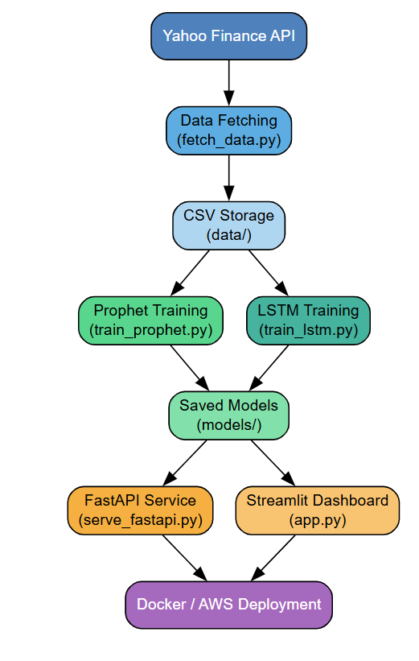

# stock-price-forecast

Stock price forecasting with two models trained side by side — Prophet
(fast, interpretable, good at seasonality) and an LSTM (sequence model,
captures nonlinear patterns Prophet can't) — served through both a FastAPI
endpoint and a Streamlit dashboard.

## Architecture



Data fetch → CSV storage → parallel Prophet/LSTM training → saved models →
served via FastAPI and/or Streamlit. Docker/cloud deployment is on the
roadmap but not yet implemented — everything currently runs locally.

## Quickstart

```bash
git clone https://github.com/rshaik99/stock-price-forecast.git
cd stock-price-forecast
pip install -r requirements.txt

# 1. fetch data (Yahoo Finance via yfinance)
python src/fetch_data.py --ticker AAPL --period 5y

# 2. train both models
python src/train_prophet.py
python src/train_lstm.py --epochs 20

# 3a. serve via FastAPI
uvicorn src.serve_fastapi:app --reload
# GET /forecast/prophet?ticker=AAPL&days=30
# GET /forecast/lstm?days=30

# 3b. or launch the Streamlit dashboard
streamlit run streamlit_app/app.py
```

## Project structure

```
src/
  fetch_data.py       Yahoo Finance -> data/<ticker>.csv
  train_prophet.py    trains + pickles a Prophet model
  train_lstm.py       trains an LSTM on a 60-day lookback window
  model_utils.py      shared load/forecast helpers for both models
  serve_fastapi.py     /forecast/prophet, /forecast/lstm
  logger.py           shared file logger
streamlit_app/app.py  interactive dashboard: pick a ticker, model, horizon
notebooks/            exploratory data analysis (also as a plain .py script)
docs/architecture.png data flow diagram
```

## Status / roadmap

- [x] Data fetching, Prophet training, LSTM training
- [x] FastAPI serving
- [x] Streamlit dashboard
- [ ] Containerization (Dockerfile)
- [ ] Cloud deployment / managed training (e.g. AWS SageMaker)
- [ ] Backtesting + accuracy metrics (currently no evaluation harness — forecasts are unvalidated)

## License

MIT — see [LICENSE](LICENSE).
